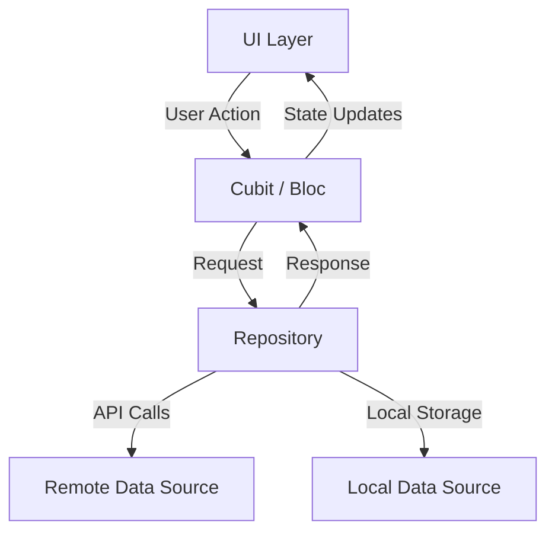

# 📚 Bookia Store

A production-style Flutter bookstore app focused on clean architecture, scalable feature modules, and polished authentication UX.


## ✨ Highlights

*   🔐 **Complete Auth Flow**: Login and Register with secure token management.
*   🌍 **Localization**: English + Arabic support using `easy_localization`.
*   📱 **Responsive UI**: Adaptive sizing for all devices with `flutter_screenutil`.
*   🏗️ **Scalable Structure**: Feature-first organization with clean boundaries.
*   🧩 **Maintainable Codebase**: Reusable core widgets, centralized strings, and themes.
*   🔍 **Advanced Search**: Real-time book search with optimized debounce logic.
*   🛒 **Shopping Experience**: Fully functional Cart and Wishlist management.

## 🧰 Tech Stack

*   **Flutter + Dart**
*   **BLoC/Cubit** for state management
*   **easy_localization** for i18n
*   **flutter_screenutil** for responsive design
*   **Dio** for networking & API integration
*   **Skeletonizer** for polished loading states
*   **flutter_gen** for strongly-typed assets
*   **Shared Preferences** for local data persistence

## 🏗️ Architecture

The project follows a **Feature-First + Clean Architecture** approach where each feature can evolve independently.

```text
lib/
├── core/
│   ├── helper/
│   ├── networking/
│   ├── routing/
│   ├── theme/
│   └── widgets/
├── features/
│   ├── auth/
│   ├── home/
│   ├── cart/
│   ├── wishlist/
│   ├── search/
│   └── profile/
└── main.dart
```

## 🔄 Data Flow



## 🎬 Project Demo


https://github.com/user-attachments/assets/53be56b5-b7d5-45f9-95c9-706b5b2dbcd4


## 📸 Screenshots


### Authentication & Home
| Splash | Onboarding | Login | Home |
| :---: | :---: | :---: | :---: |
|  |  |  |  |

### Features
| Search | Cart | Wishlist | Profile |
| :---: | :---: | :---: | :---: |
|  |  |  |  |

## 🚀 Getting Started

### Prerequisites

*   Flutter SDK installed
*   Dart SDK installed
*   Android Studio or VS Code

### Run Locally

```bash
git clone https://github.com/AHMEDCS50MAHMOUD/bookia/edit/master
cd bookia
flutter pub get
flutter run
```

### Optional: Regenerate Generated Files

```bash
flutter pub run build_runner build --delete-conflicting-outputs
```

## 🤝 Contributing

Contributions are welcome.

1.  Fork the repository
2.  Create your branch: `git checkout -b feature/your-feature`
3.  Commit changes: `git commit -m "Add your feature"`
4.  Push branch: `git push origin feature/your-feature`
5.  Open a Pull Request

---
Developed with ❤️ by Ahmed Darwish
